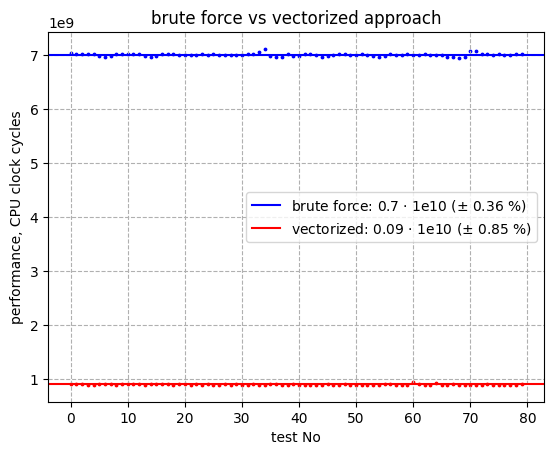
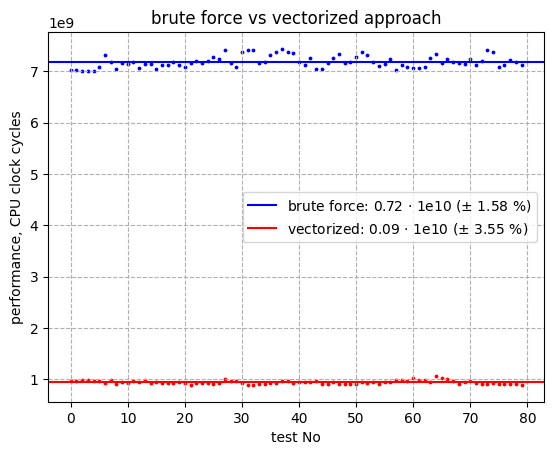

# Визуализация множества Мандельброта
---


# Теория
Множество Мандельброта - множество точек на комплексной плоскости, удовлетворяющее уравнению $Z_{n} = Z_{n - 1}^2 + C$, которые остаются в пределах некоторого радиуса для больших $n$. В случае "невылета" точки за пределы радиуса, красим соответствующую точку $C$ в черный цвет, в другом случае - выбираем цвет пропорционально $n$ для которого она вылетела за пределы радиуса.


*Источник: https://toddthomas.space/2020/12/14/render-the-mandelbrot-set-in-higher-resolution.html*

## Наивный подход
Наивный подход максимально прозрачен с точки зрения математики. \
Мы пробегаемся по всем точкам экрана и еще одним циклом считаем для каждой точки вылетает ли последовательность чисел, рассчитанных по формуле, за пределы окружности или нет. \
Реализация данного подхода требует трех уровней вложенности и определяется числом итераций, требуемых на проверку, стабильна точка или нет. \
Асимптотическая оценка сложности: $O (width * heiht * n_{iterations})$ - достаточно медленно, чтобы картинка грузилась не сразу. \
Особенно замедление заметно при приближении экрана.

## Векторизированный подход
Логика вычислений диктуется математикой и задание требовало ее не менять, поэтому пространство для ускорения остается только в аппаратных оптимизациях.

С каждой точкой (пикселем) экрана мы выполняем одинаковые действия, значит процесс можно векторизовать.

### Увеличение степени параллелизма с применением векторных инструкций (векторизация)
Векторизация означает возможность применения инструкций к вектору данных целиком, такие возможности предоставляют SIMD (Single Instruction Multiple Data) инструкции, позволяющие использовать параллелизм на уровне данных.

Это достигается за счет использование больших (>=128 бит) XMM регистров, в которых данные размещаются как в массиве.

### Применение к задаче
В задаче отрисовки множества Мандельброта можно считать несколько точек за раз. Их число диктуется набором инструкций, которые поддерживает ваш процессор (в моем случае это был AVX2, больше можно узнать в [этом разделе](#повторить-тесты-производительности).

Это позволяло мне обрабатывать по 8 точек за инструкцию (8 float значений).

Таким образом можно ожидать ускорение в $\approx$ 8 раз по сравнению с невекторизованным подходом.

# Сравнение подходов

[Сразу перейти к результатам](#результаты-сравнения)

## Методика измерения

- #### измерение времени производится с помощью считывания значения *time stamp counter* (TSC) инструкцией ```rdtcs``` (ассемблерная вставка)

    <blockquote>  <code>tests/tester.cpp</code>

    ```c
    unsigned long long GetTicks ()
    {
        unsigned long long ticks_rax = 0;
        unsigned long long ticks_rdx = 0;

        asm volatile (
            "rdtsc\n\t"
            : "=a" (ticks_rax), "=d" (ticks_rdx)
        );

        return (ticks_rdx << 32) | ticks_rax;
    }
    ```
    </blockquote>

    **Обоснование**

    Забегая вперед, таким образом будем получать разницу (*до и после запуска подопытной функции*) порядка **1e10**.

    Для проверки валидности этого метода, тесты были запущены вхолостую, то есть между двумя функциями `GetTicks()` не было ничего.

    <details>

    <summary>разница составила порядка 1e1 - на 8 порядков меньше - <b>этой погрешностью можно пренебречь</b></summary>

    

    </details>

- #### выбирается файл с тестовыми данными и измеряетсясь разница в показаниях TSC до и после запуска функции для каждого тесткейса

    <blockquote>  <code>tests/testcases/cases2.txt</code>

    ```
    80                      < number of testcases

    100   100   1500
    100   100   1500
    100   100   1500
    ...
    ```
    </blockquote>

    Каждый из этих тесткейсов использовался дважды: для brute_force approach и для vectorized approach.

- #### результаты сохраняются в csv файл

    <blockquote>  <code>tests/testresults/res1.csv</code>

    ```
    brute force, 15119607342, 14864109413, ...
    vectorized, 5221665671, 5746416055, ...
    ```
    </blockquote>

- #### csv файл обрабатывается python-скриптом, который строит график

## Результаты сравнения

Тесты запускались в одинаковых условиях под `-O0`, `-O1` и `-O3`.

<p float="left">
  
  
  
</p>

- '-O0' - использование SIMD инструкций дало ускорение в $\approx 3$ раза
   
- '-O1' - ускорение в $\approx 7.7$ раз
- '-O3' - ускорение в $\approx 8$ раз

Однако оптимизации компилятора не дали никакого эффекта, разница в значениях имеет низкую статистическую значимость, можно считать скорость выполнения одинаковой.


# Использование и воспроизведение тестов

### Мой процессор


*Intel(R) Core(TM) i5-5200U CPU @ 2.20GHz. **Code name**: Broadwell-U (Core i5). **Technology**: 14nm. Instructions: HT, MMX, SSE(1, 2, 3, 3S, 4.1, 4.2), AVX(1, 2), FMA(3), AES, CLMUL, RdRand, VT-x, x86-64*

### Посмотреть на фрактал

```
make
make run
```

**Навигация:**
- перемещение - стрелочками на клавиатуре
- отдаление ```<```, приближение ```>```

### Повторить тесты производительности

Вы можете повторить дефолтные тесты ($\approx$ 10 мин)

```
make
make test
make analyze
```

Или запустить свои тесты:

```
make
./mandelbrot.out -tp <файл_с_результатами.csv> <файл_с_тесткейсами.csv>
python3 analyze_results.py <path_to_graph.png> <test_results_path.csv> <test_results_name>
```


(**Note:** программа требует существования файлов с результатами и кейсами, в случае их неоткрытия/несуществования она подгрузит дефолтные файлы, указанные в ```tester.h``` и затрет то, что было там раньше)

## Источники

- Intel Intrinsics Guide
- https://www.youtube.com/watch?v=FFftmWSzgmk
