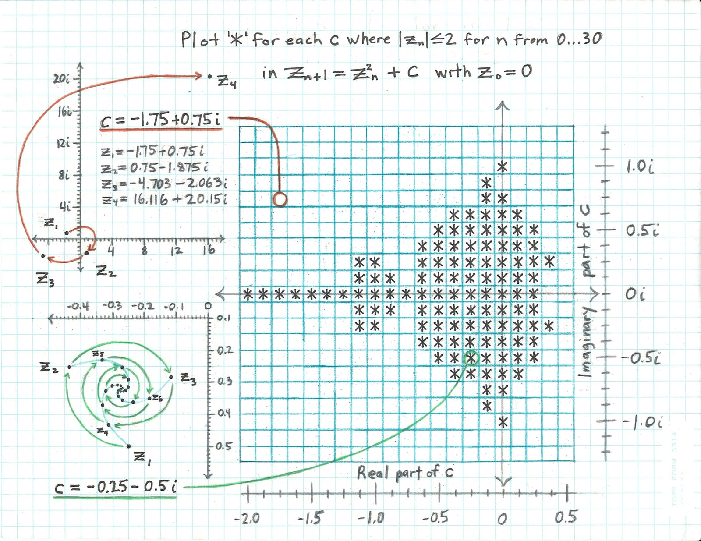

# Визуализация множества Мандельброта
---


## Теория
Множество Мандельброта - множество точек на комплексной плоскости, удовлетворяющее уравнению $Z_{n} = Z_{n - 1}^2 + C$, которые остаются в пределах некоторого радиуса для больших $n$. В случае "невылета" точки за пределы радиуса, красим соответствующую точку $C$ в черный цвет, в другом случае - выбираем цвет пропорционально $n$ для которого она вылетела за пределы радиуса.


*Источник: https://toddthomas.space/2020/12/14/render-the-mandelbrot-set-in-higher-resolution.html*

## Наивный подход
Наивный подход максимально прозрачен с точки зрения математики. \
Мы пробегаемся по всем точкам экрана и еще одним циклом считаем для каждой точки вылетает ли последовательность чисел, рассчитанных по формуле, за пределы окружности или нет. \
Реализация данного подхода требует трех уровней вложенности и определяется числом итераций, требуемых на проверку, стабильна точка или нет. \
Асимптотическая оценка сложности: $O (width * heiht * n_{iterations})$ - достаточно медленно, чтобы картинка грузилась не сразу. \
Особенно замедление заметно при приближении экрана.

## Векторизированный подход
Логика вычислений диктуется математикой и задание требовало ее не менять, поэтому пространство для ускорения остается только в аппаратных оптимизациях.

С каждой точкой (пикселем) экрана мы выполняем одинаковые действия, значит процесс можно векторизовать.

### Векторизация
Векторизация означает возможность выполнения одинаковых действий над несколькими объектами одновременно, такие возможности предоставляют SIMD (Single Instruction Multiple Data) инструкции, позволяющие использовать параллелизм на уровне данных.

Это достигается за счет использование больших (>=128 бит) XMM регистров, в которых данные размещаются как в массиве.

### Применение к задаче
В задаче отрисовки множества Мандельброта можно считать несколько точек за раз. Их число диктуется набором инструкций, которые поддерживает ваш процессор (в моем случае это был AVX2, больше можно узнать в [этом разделе](#повторить-тесты-производительности)

# Использование и воспроизведение результатов

### Мой процессор


*Intel(R) Core(TM) i5-5200U CPU @ 2.20GHz. **Code name**: Broadwell-U (Core i5). **Technology**: 14nm. Instructions: HT, MMX, SSE(1, 2, 3, 3S, 4.1, 4.2), AVX(1, 2), FMA(3), AES, CLMUL, RdRand, VT-x, x86-64*

### Посмотреть на фрактал

```
make
make run
```

**Навигация:**
- перемещение - стрелочками на клавиатуре
- отдаление ```<```, приближение ```>```

### Повторить тесты производительности


```
make
make test <- запустит дефолтный набор тестов
```


если вы хотите замерить производительность на собственных данных, выполните следующую команду
```
./mandelbrot.out -tp <файл_с_результатами.csv> <файл_с_тесткейсами>
```
(замечу, что программа требует существования файлов с результатами и кейсами, в случае их неоткрытия/несуществования она подгрузит дефолтные файлы, указанные в ```tester.h```)


## Источники

